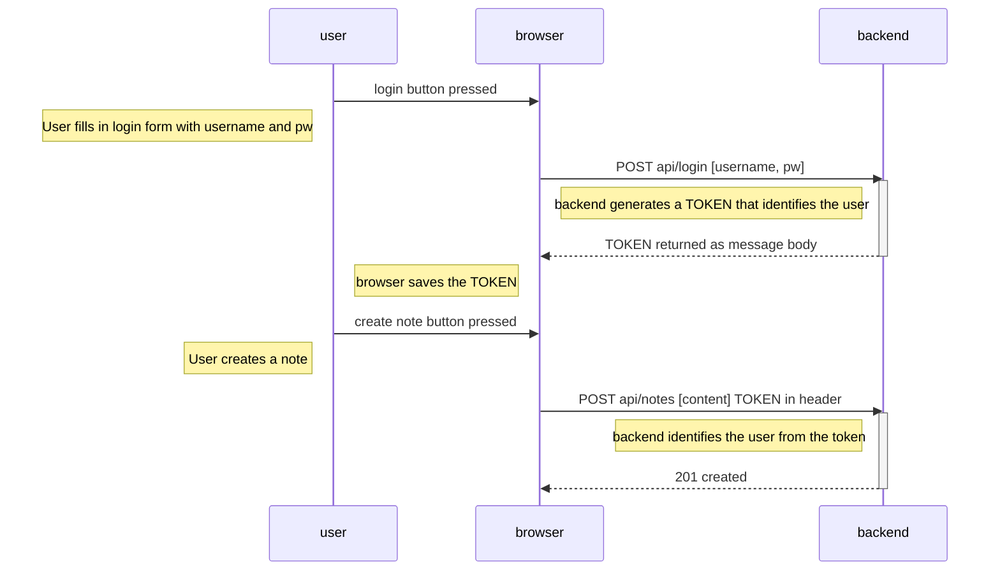

toRead

https://hackernoon.com/flaky-tests-a-war-that-never-ends-9aa32fdef359  

https://developer.mozilla.org/en-US/docs/Web/JavaScript/Reference/Global_Objects/Promise/then

https://github.com/getify/You-Dont-Know-JS/blob/1st-ed/async%20%26%20performance/ch3.md

https://www.digitalocean.com/community/tutorials/the-ins-and-outs-of-token-based-authentication#how-token-based-works

https://medium.com/techtrument/multithreading-javascript-46156179cf9a

https://developer.mozilla.org/en-US/docs/Web/API/Web_Workers_API/Using_web_workers

javascript: primitive types are copied by value, objects by reference.
Lodash library for operations on objects  

VSode:
"editor.formatOnPaste": true
copy line down command d  

.then(  
.catch(  
  
or try {  
await   
} catch (exception) {  
}  

JSON.parse(loggedUserJSON)  

0.  
In traditional web applications, the browser is "dumb". It only fetches HTML data from the server, and all application logic is on the server.  
A server can be created using Java Spring, Python Flask or Ruby on Rails to name just a few examples.  
The example uses Express library with Node.js. This course will use Node.js and Express to create web servers.  

curl https://studies.cs.helsinki.fi/exampleapp/new_note  -d "note=AV USigma"  --ssl-no-revoke  
curl -X POST -H "Content-Type: application/json" -d '{"id":"4","content":"burp","important":false}' http://localhost:3001/api/notes  

1.  
React components (like const App = () => <></>) are technically JavaScript functions. They return jsx (looks like html markup, but in fact stuff that is compiled by Babel into js).
In practice, JSX is much like HTML with the distinction that with JSX you can easily embed dynamic content by writing appropriate JavaScript within curly braces. The idea of JSX is quite similar to many templating languages, such as Thymeleaf used along with Java Spring, which are used on servers.  
JSX is "XML-like", which means that every tag needs to be closed.  
First letter of React component names must be capitalized.  
it is forbidden in React to mutate state directly, so use .concat (returns new copy) instead of .push on arrays.  
infinite loop: `<button onClick={() => { props.likeBlog(props.blog.id) }}>` rather than `<button onClick={likeBlog(props.blog.id)}>`  
props von React components have to be ({blog})
export default Togglable for components, not  { Togglable }  

3.  check minFetch
use ids, not array indices, as keys in rendering lists  
control the form input with state  
———————————————————————————————
source JSON on server  
  
browser state fetched from server: only once on first render using useEffect(, [])  
  
tempVariable from button input (aka button “display buffer” state)  
(button onClick: () => irgendwas)  
	-> post / put / delete this tempVariable to server  
	-> wait for response, set browser state with response (not from tempVariable), using setState  
—————————————————————————————
useEffect(() => {}, [currency]) not useEffect(, currency)  
in React use className= instead of class= to use in .css (aka ‘class selector’)  
or use style= within a component, filling with a js object (aka ‘inline style’)  
setTimeout(()=>{something}, 0) to defer something until the stack is clear  
 https://www.youtube.com/watch?v=8aGhZQkoFbQ  

3. check phonebook, check minMongodb
We will be building our backend on top of NodeJS, which is a JavaScript runtime based on Google's Chrome V8 JavaScript engine.  
Browsers do not yet support all of JavaScript's newest features. Due to this fact, a lot of code run in browsers has been transpiled from a newer version of JavaScript to an older, more compatible version. Today, the most popular way to do transpiling is by using Babel. Transpilation is automatically configured in React applications created with Vite.
The situation with JavaScript running in the backend is different. The newest version of Node supports a large majority of the latest features of JavaScript, so we can use the latest features without having to transpile our code.  
--Putting front into backend simple: first in frontend fetch service change url to relative, then npm run build to generate a dist folder with frontend production code, then copy this to backend folder  
	then app.use(express.static('dist')) in backend  
--connecting to database:  
 (log in to account: f... Mangodb)  
 add url (mongodb+srv://thomastoumasu:pw@cluster0.hmhtqmw.mongodb.net/phonebook?retryWrites=true&w=majority&appName=Cluster0) in .env (dev mode) or in render  
 in ./models/person.js connect, create schema and model, overwrite toJSON, export model  
If you're having issues with content.body being undefined for seemingly no reason, make sure you didn't forget to add app.use(express.json()) near the top of the file.  
note backend: https://github.com/fullstack-hy2020/part3-notes-backend  

4.  
testing js: There are a large number of test libraries, or test runners, available for JavaScript. The old king of test libraries is Mocha, which was replaced a few years ago by Jest. A newcomer to the libraries is Vitest, which bills itself as a new generation of test libraries. Nowadays, Node also has a built-in test library node:test, which is well suited to the needs of the course. https://fullstackopen.com/en/part4/structure_of_backend_application_introduction_to_testing#testing-node-applications  
testing backend: use supertest to test the API.  check minBackendwTests, check blogList
--best to run tests using a database that is installed and running on the developer's local machine. The optimal solution would be to have every test execution use a separate database, for example by running Mongo in-memory or by using Docker containers. Here: in test mode change env so use a testNoteApp collection in atlas that is deleted and built again before each test. (4b)   
--Separate (4a) the (f.e. Express) app and the code taking care of the web server. One of the advantages of this method is that the application can now be tested at the level of HTTP API calls without actually making calls via HTTP over the network, this makes the execution of tests faster.  
 MONGOURL, PORT to utils/config  
 console.log to utils/logger  
 db model to models/blog  
 routes to controllers/blogs, in index.js app.use('/api/blogs', blogsRouter)  
 middelware to utils/middelware  
--intuition: test emulates frontend requests to the backend and checks:  
-responses (status, content, some header)   
-changes in database  

--npm run test with test: node --test  
  then in write tests in tests/bla.test.js: const { test } = require('node:test')  
--Use supertest (as a dev dependency) to test separated app:    
(if the server is not already listening for connections then it is bound to an ephemeral port for you so there is no need to keep track of ports. In other words, supertest takes care that the application being tested is started at the port that it uses internally.)  
useful functions to generate test input and check api output: const api = supertest(app), then f.e. await api.get('/api/notes').expect(200).expect('Content-Type', /application\/json/)  
--get rid of try catch with require('express-async-errors') - looks like it is now native in Express5. If an exception occurs in an async route, the execution is automatically passed to the error-handling middleware.  
multiple async calls: await Promise.all(arrayOfPromises), with arrayOfPromises = arrayOfNotes.map(note => note.save())  
--return code: https://www.rfc-editor.org/rfc/rfc9110.html#name-400-bad-request  
  < 400 is no error  
  201 created (post)  
  204 not found (delete ok, return 204 and no content, delete but was not found, return 410 gone)  
     or now: delete ok, return 204 and content, delete but was not found, return 204 and nothing  
  400 is bad request (i.e. content missing, bad id)  
  401 unauthorized (see below)
  410 gone (for example for delete)
do not forget return if post request but not because of something  
watch for header content type not specified  
use validation from mongoose (returns 400 if post input does not match criteria)  
error handling:  
-from own code:  
usersRouter.post('/', async (request, response) => {  
  const body = request.body  
  if (!Object.hasOwn(body, 'username') || body.username.length < 3) {  
    // response.statusMessage = 'username or password missing'  
    return response.status(400).json({ error: 'username or password missing' })  
  }  
-from for example mongoose validation:  
in middleware.js :  
const errorHandler = (error, request, response, next) => {  
 if (error.name === 'ValidationError') {  
    return response.status(400).json({ error: error.message }) // bad request  
  }  
-test both like  
const result = await api.post('/api/users/').send(tooShortUsernameUser)  
assert(result.body.error.includes('both username and password must contain at least 3 characters'))  
  
4c design database note - user  https://fullstackopen.com/en/part4/user_administration  
There is a one-to-many relationship between the user (User) and notes (Note): one user has many notes.  
If relational database the implementation is straightforward: Both resources would have their separate database tables, and the id of the user who created a note would be stored in the notes table as a foreign key.  
If document database, different modelling ways:  
 note stores id of user  
 or user stores ids of notes   
 or both (here we use this form)  
 or only one collection user that has a notes property: an array of note objects (notes would be tightly nested under users and the database would not generate ids for them)  

Ensure username is unique: uniqueness index from mongoose validation. But caution: when adding a uniqueness index, make sure that the database is in a healthy state (if there are already documents in the database that violate the uniqueness condition, no index will be created.). And returns MongoServerError, not ValidationError. 

4d token

or server-side session https://fullstackopen.com/en/part4/token_authentication#problems-of-token-based-authentication

5. frontend tests with react-testing-library
Also using user-event from i
jsdom library simulates a web browser  
-check if text is displayed  
-check if handlers are called when user clicks button  
-check that handlers pass the right information  
end2end test  
-use  
	page.locator('.error')  
	.locator('..') (locator accepts not only .css selectors but also XPath selectors) to get the parent element  

7. Redux  
Declare a store, make it available with Provider  
Then in all components below can access state and actions
Without toolkit:  
in main.jsx, import noteReducer from './reducers/noteReducer'   const store = createStore(noteReducer) and render App inside /<Provider store={store}>
then in App.jsx import useSelector, useDispatch from 'react-redux' and use them as   const dispatch = useDispatch()  dispatch(createNote(content)),   const notes = useSelector(state => state)
with export const createNote = content => { return ({ type: 'NEW_NOTE', payload: {}  }) } in reducer.js
multiple states: be careful, actions get dispatched to everyone
const reducer = combineReducers({
  notes: noteReducer,
  filter: filterReducer
})
const store = createStore(reducer)  
with toolkit: just define action creators, can also put the async stuff in it to cleanly separe frontend from state/getdata stuff (cf. ex 6.10-13, redux_anecdotes)  

